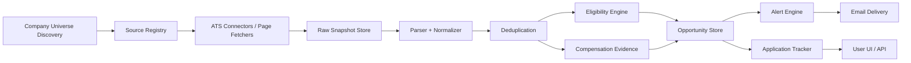

# Architecture

Revised plan v2 after reviewing the main risks around coverage gaps, scraping assumptions, eligibility errors, stale postings, source failures, and operating cost.

## System Overview

The system should be organized as a small set of composable services with a shared normalized data model. Discovery should happen in layers: company-universe expansion, source ingestion, parsing, normalization, deduplication, eligibility evaluation, enrichment, alerting, and application tracking.

## Core Components

### 1. Company Universe Service

- Maintains candidate employers and discovery provenance.
- Expands from seed companies to related employers using curated lists, ATS fingerprints, public job feeds, accelerator cohorts, alumni signals, and startup indexes.
- Tags each company with source confidence, discovery date, validation status, and preferred source URLs.

### 2. Source Registry

- Stores source type, supported connector, robots and terms notes, polling cadence, priority, and expected freshness.
- Distinguishes machine-friendly ATS sources from custom pages requiring HTML parsing or manual review.

### 3. Connector Layer

- One connector per ATS family or page pattern.
- Connectors expose a common interface: list jobs, fetch job detail, fetch snapshots, and report capability metadata.
- Favor structured endpoints when available, then stable HTML parsing, and only then browser automation if compliant and necessary.

### 4. Raw Snapshot Store

- Stores page HTML, JSON payloads, and extracted text as immutable snapshots.
- Enables reproducible parsing, debugging, and change detection.

### 5. Normalization Pipeline

- Converts source-specific records into a canonical job schema.
- Extracts canonical fields, preserves raw fields, and attaches provenance to every normalized field when possible.
- Emits explicit unknowns instead of fabricating values.

### 6. Deduplication And Identity Resolution

- Builds a stable opportunity identity from source IDs, URLs, content hashes, and fuzzy matching.
- Tracks lineage across reposts, mirrors, and edited listings.
- Prevents alert spam by collapsing semantically identical jobs.

### 7. Eligibility Engine

- Uses rule tiers:
  - Hard filters for explicit exclusions.
  - Strong positive signals for clear 2028-eligible internships.
  - Ambiguous cases routed to unknown or needs-review.
- Produces evidence-backed output with confidence and reasons.
- Can be updated without changing ingestion logic.

### 8. Compensation Evidence Service

- Collects exact compensation snippets and structured salary fields.
- Stores evidence separately from interpretation.
- Supports later analytics without leaking unsupported estimates into user-facing data.

### 9. State And Timeline Store

- Tracks every state transition and source change.
- Enables freshness-aware alerts and historical search.
- Supports manual overrides for the application tracker.

### 10. Alert Engine And Email Worker

- Runs after dedupe and eligibility so alerts are high-signal.
- Supports digest mode, immediate alerts for high-priority roles, and reminders for stale saved items.
- Uses queue-based delivery to isolate mail retries from discovery failures.

### 11. Application Tracker UI And API

- Lets the user save roles, annotate status, and inspect evidence.
- Shares the same canonical opportunity identity as the ingestion system.

## Data Model Sketch

- Company
  - id, name, canonical domain, ATS links, discovery provenance, validation status
- Source
  - id, source type, connector name, priority, cadence, compliance notes
- Job
  - id, company id, canonical url, title, location, remote policy, employment type, term, status
- JobSnapshot
  - id, job id, source payload, extracted text, checksum, fetched at
- EligibilityDecision
  - job id, classification, confidence, reasons, evidence refs, model/rule version
- CompensationEvidence
  - job id, evidence type, raw text, structured amount, currency, frequency, provenance
- JobStateEvent
  - job id, event type, old value, new value, occurred at
- Application
  - job id, stage, notes, deadlines, follow-up dates, manual overrides

## Processing Strategy

- Discovery should be incremental, not full refresh by default.
- Expensive fetches should happen only after lightweight source ranking and dedupe checks.
- Eligibility should run after normalization but before alerting.
- Alerts should read from state changes, not raw crawls.

## Deployment Architecture

- Start with a single backend service and a separate worker process to reduce operational complexity.
- Use a relational database for canonical records and history.
- Use object storage for raw snapshots and large artifacts.
- Use a queue for ingestion, parsing, alerting, and retry work.
- Keep the frontend lightweight and read-only where possible.

## Compliance Guardrails

- Respect source terms, rate limits, and robots restrictions.
- Maintain source capability metadata so unsupported methods are never assumed to exist.
- Prefer public, documented endpoints and visible page content over hidden or bypass-oriented techniques.

## Failure Modes And Mitigations

- Missing companies: continuous universe expansion, periodic review of blind spots, and source provenance auditing.
- Unsupported scraping assumptions: per-source capability flags and fallback parsing modes.
- False eligibility classifications: conservative rules, confidence scoring, and explicit unknown states.
- Stale postings: job lifecycle events, TTLs, reopen detection, and freshness-aware alerts.
- Source failures: retries, backoff, dead-source quarantine, and alternate connector routing.
- Operational cost: incremental scheduling, cache reuse, and avoiding browser automation unless it materially improves recall.